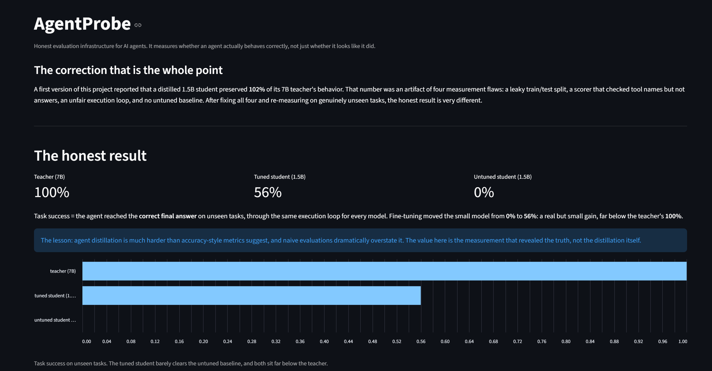

<p align="center"></p>

# AgentProbe

AgentProbe evaluates calculator-agent runs, recording tool actions, final answers,
completion, errors, and repeated calls. It includes a teacher/student fine-tuning
experiment and an untuned baseline. This is an experimental evaluation project.

## Result status

**Scorer 2.0 evaluation completed on September 22, 2026, using 759 held-out
tasks and one run per task for each model.**

| Model | Successful tasks | Task success |
|---|---:|---:|
| Qwen2.5 7B teacher | 735 / 759 | 96.84% |
| Qwen2.5 1.5B untuned student | 111 / 759 | 14.62% |
| Qwen2.5 1.5B QLoRA-tuned student | 716 / 759 | 94.33% |

Fine-tuning improved task success by **79.71 percentage points** over the untuned
baseline. The tuned student finished **2.50 percentage points** behind the teacher.

The tuned student completed every task with zero recorded parsing errors,
tool execution errors, or detected loops. Completion does not imply correctness.

On the two task families excluded from training, `f_len5_b` and `f_mul_add_mul`,
the tuned student succeeded on **367 / 400 tasks (91.75%)**.

The remaining 43 failures comprised:

- 32 runs with an incorrect final tool result.
- 11 runs with a correct final tool result followed by an incorrect final answer.

These findings apply to this synthetic arithmetic benchmark and execution protocol.

**Evidence:**
[Comparison summary](docs/results/2026-09-22/comparison.json) |
[All 2,277 execution traces](docs/results/2026-09-22/comparison_runs.jsonl)

Experiment ID: `40af95f76f6841daba30d05622990717`.

The root `comparison.json` and older traces remain historical evidence. Their
100% / 0% / 56% scores checked tool results but could accept wrong final answers.
Earlier results also suppressed repeated student calls and used a different
training conversation format. Do not cite those figures as current task success.

The current policy separates:

- `tool_result_correct`: the last successful tool result equals the reference.
- `answer_correct`: the model's explicit final answer equals the reference.
- `completed`: the run finished with a model final answer.
- `task_success`: completed, correct final answer supported by the last tool result,
  with no final failed step. A calculator task requires at least one tool call.
- Efficiency on successful eligible tasks, tool errors, parser errors, loops/cycles,
  and recovery when an error actually occurred.

The parser accepts one complete action per turn. It does not remove repeats or
scan past invalid text. The same text instructions and action-feedback engine
are used across providers; the teacher still uses Ollama's structured tool API,
while the students use text parsing. That interface difference remains a limitation.

## CPU quick start

```bash
git clone https://github.com/hemachandra666/agentprobe.git
cd agentprobe
uv sync --locked --dev
uv run --locked pytest -q
uv run --locked python -m agentprobe.check_leakage
uv run --locked python -m agentprobe.replay --input docs/results/2026-09-22/comparison_runs.jsonl
```

The consolidated reliability suite passes 83 CPU tests. The supplied dataset contains 1,441
training questions and 759 test questions, with zero exact question overlap
and zero within-split duplicates.

Replay audits saved evidence, verifies task identity and successful tool arithmetic,
and checks the matching experiment summary when available. It preserves per-family
metrics. Use `--data-dir` for an alternate dataset and `--summary` for an explicit
comparison file. It cannot recover actions omitted by legacy parsers, and replay
is not fresh inference.

The wheel includes example train/test data. Loaders prefer an explicit data
path, then `./data` if present, then the packaged examples. `task_gen` generates
working datasets in `./data`. Install-time paths are not used for outputs.

## Teacher evaluation

Install and start Ollama, then pull the teacher. A GPU is optional for Ollama,
but running these models on a CPU can be slow.

```bash
ollama pull qwen2.5:7b
uv run --locked python -m agentprobe.run_eval --max-tasks 10 --runs 1
uv run --locked python -m agentprobe.benchmark --models qwen2.5:7b --max-tasks 10
```

Each experiment writes to a new `runs/<experiment_id>/` directory. Complete
records include zero-call runs, termination, raw responses, typed errors and
scores. Failed experiments retain evidence. Summaries include per-family results.
Provider failures and timeouts abort a comparison and mark it failed; they are
not published as a completed model benchmark.

## GPU training and comparison

The revised pipeline completed model loading, training, and evaluation on an
**NVIDIA GeForce RTX 5080 Laptop GPU with 16 GB VRAM**, running WSL Linux
and Python 3.11.16.

A separate GPU environment was used:

```bash
uv venv --python 3.11 .venv-gpu

uv pip install --python .venv-gpu/bin/python \
  -e ".[gpu]" \
  "torch==2.8.0+cu128" \
  "torchvision==0.23.0+cu128" \
  "xformers==0.0.32.post2" \
  "torchao==0.13.0" \
  "unsloth==2026.9.8" \
  "unsloth-zoo==2026.9.7" \
  --default-index https://pypi.org/simple \
  --extra-index-url https://download.pytorch.org/whl/cu128 \
  --index-strategy unsafe-best-match

uv pip check --python .venv-gpu/bin/python
```

This records the installation approach used, not a complete GPU lockfile.
The tested environment also contained Transformers 5.5.0 and TRL 0.24.0.
Unpinned dependencies may resolve differently on future installations.
The index strategy considers matching packages across both listed indexes.

Unsloth warned that the installed TorchAO integration was unusable and bypassed
it. LoRA training and inference nevertheless completed successfully.

Use `.venv-gpu/bin/python` directly for GPU commands. The CPU development
environment managed by `uv run` is separate.

The experiment used these stages:

```bash
.venv-gpu/bin/python -m agentprobe.check_leakage
.venv-gpu/bin/python -m agentprobe.generate_teacher --runs 1 --max-tasks 1000
.venv-gpu/bin/python -m agentprobe.prepare_training
.venv-gpu/bin/python -m agentprobe.train_student --epochs 1
.venv-gpu/bin/python -m agentprobe.compare \
  --models teacher untuned tuned \
  --max-tasks 759 \
  --runs 1
```

Back up existing generated datasets and `student_lora/` before rerunning:
generation, preparation, and training reuse their output paths. Teacher generation
accepts `--output` (default `./teacher_data.jsonl`) and records all attempts and
accepted examples under a unique `runs/teacher-<id>/` directory beside the output.
A timeout or provider failure aborts generation without replacing the previous
dataset. Partial evidence remains available. Successful generation replaces the
requested output atomically. No clean successful examples also leaves old data intact.

The recorded teacher generation retained 656 clean successful trajectories,
producing 1,730 training and 319 validation next-action examples.

Training used the 4-bit `unsloth/Qwen2.5-1.5B-Instruct` base, LoRA rank 16,
alpha 16, and 18,464,768 trainable parameters.

An exploratory three-epoch run showed worsening validation loss after epoch 1.
A fresh one-epoch run was selected using validation loss before final-test
evaluation. It completed 217 optimizer steps in approximately 298 seconds,
with validation loss 0.09077.

`prepare_training` splits whole training questions into train/validation groups,
checks them against final-test tasks, and writes next-action examples with real
observations. Preparation validates each saved task against the canonical training
dataset, recomputes successful tool arithmetic, and rejects corrupted examples
before writing outputs. A manifest hashes both files. `train_student` rejects stale inputs.

The current trainer saves the final adapter; automatic selection of the best
validation checkpoint remains an improvement.

Keep final-test tasks out of checkpoint/hyperparameter selection. Further
changes informed by the inspected test failures require a fresh held-out
evaluation while preserving the original result.

## Dashboard

```bash
uv run --locked streamlit run src/agentprobe/dashboard.py
```

Open http://localhost:8501.

The dashboard defaults to the published evidence when available. Expand
**Choose evaluation file** to select another experiment's `comparison.json`.

For this experiment, use:

```text
docs/results/2026-09-22/comparison.json
```

The dashboard labels historical or incomplete files and does not present them
as validated current results.



## Limits and interpretation

- Only two calculator tools and synthetic integer chains are covered. Correct
  final answers do not prove general reasoning or appropriate intermediate arguments.
- Fixed reference paths are diagnostics, not a proof that other paths are invalid.
- Untuned performance measures this exact prompt, protocol and parser. It does
  not establish that a model is generally incapable of tool use.
- An audit found 26 test questions mathematically equivalent to questions in the
  full training pool after swapping the first two operands. Of the prepared
  examples, 12 test questions have equivalents in training and 2 in validation.
  Excluding all 26 as a post-hoc sensitivity check gives tuned success of
  690/733 (94.13%); this does not replace the original benchmark. Future datasets
  should group equivalent questions before splitting.
- Exact question separation does not establish absence of semantic similarity.
  The two held-out task families account for 400 of the 759 test tasks.
- Zero tool execution errors does not mean zero parsing errors or incorrect
  answers. These metrics must be interpreted separately.
- Sampling uncertainty, multiple training seeds, broader task domains, and controlled
  GPU memory/latency measurements remain future work. Smaller parameter count alone
  does not demonstrate measured performance savings.
- A deadline bounds how long the engine waits. Python cannot cancel an already
  running GPU/native call in its daemon worker. The comparison aborts after timeout;
  stop the process before restarting. Hard GPU cancellation needs process isolation.
- Ollama requests use a timeout and fixed generation options. Students use greedy
  generation with an output-token cap. Immutable model revisions, adapter hashes,
  and a complete GPU dependency lock remain reproducibility improvements.

See [the implementation handoff](docs/FIX_HANDOFF.md) for the original changes
and planned checks. GPU training and evaluation have since completed as
documented above.

## Capturing the GPU environment

Run `.venv-gpu/bin/python scripts/capture_gpu_environment.py` on the machine
used for inference. It records the currently installed package versions in
`requirements-gpu.txt` and hardware details in `docs/results/2026-09-22/gpu_environment.json`.
The snapshot excludes the editable project path. It is environment evidence,
not a validated portable lockfile; use the documented CUDA indexes when testing
a clean installation. Capture time is recorded separately from experiment time.

See [the consolidated reliability review](docs/RELIABILITY_REVIEW.md) for the
verified scope and remaining research and reproducibility work.

## License

Apache 2.0.
